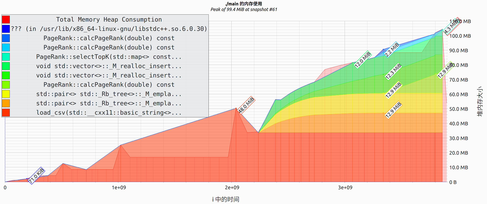

# PageRank实验报告

> 方天宬 023033910076

## 1. 实验原理

PageRank是由谷歌创始人拉里·佩奇（Larry Page）和谢尔盖·布林（Sergey Brin）提出的一种网络页面排序算法，其核心思想是根据网页之间的超链接关系来计算网页的重要性。简单来说，一个网页的PageRank值将取决于指向它的其他网页的数量和质量，如果一个网页被很多其他重要的网页指向，那么这个网页也被认为是重要的。

PageRank算法主要基于网页链接的转移矩阵，该矩阵描述了网页之间的链接结构。算法以随机游走模型为基础：假设我们随机地从某个网页开始，每次以固定概率$\beta$跟随网页的链接到达另一个网页，或者以$1-\beta$的概率随机跳转到任何一个网页。在多次迭代后，到达每个网页的概率会达到平衡，这个概率分布就是PageRank值。

## 2. 实现细节

代码内容见page-rank.cpp，以下简要介绍实现思路：

1. 加载数据：使用load_csv函数从CSV文件中读取表示网络链接的数据。这个数据包括了网页间的链接关系，表示为一对整数（from_node, to_node）；
2. 初始化并构建网络图表示：通过PageRank类构造函数，将链接数据转换成图的内部表示。构造函数中将调用registerIdx方法来将网页节点映射为一个整数索引，并据此建立图的邻接表结构；
3. 计算PageRank值：使用calcPageRank成员函数来迭代计算每个网页的PageRank值。该函数中实现了迭代公式，按照PageRank算法计算所有网页的分数；
4. 选择排名靠前的网页：用selectTopK静态成员函数来选择具有最高PageRank值的前k个网页。函数中先将所有网页及其PageRank值存入一个向量中，然后对其按PageRank值进行降序排序，并选取前k个元素；
5. 保存结果：使用save_csv函数将选取的排名靠前的网页及其PageRank值保存到CSV文件中。

## 3. 效率测量

实验在Ubuntu22.04操作系统，i7-10700K CPU、32GB内存的环境下进行。

main函数开始和结束时使用`std::chrono::system_clock::now()`记录时间，做差得到运行时间。实验时给定输入为`web_links.csv`，多次测量运行时间，得到平均耗时大约为2.50s。

使用valgrind和massif工具测量内存开销，得到峰值内存为99.4MB，内存占用时序图如下：

## 4. 优化方案

`page-rank.cpp` 是优化后的最终方案，其中包含三种优化：

1. 使用cpp而非python实现page-rank，从语言层面加速算法的执行效率；
2. 使用邻接表而非邻接矩阵存储图，充分利用了输入数据的离散特征；
3. 使用OpenMP进行并行计算，优化后用时大约下降0.12s

